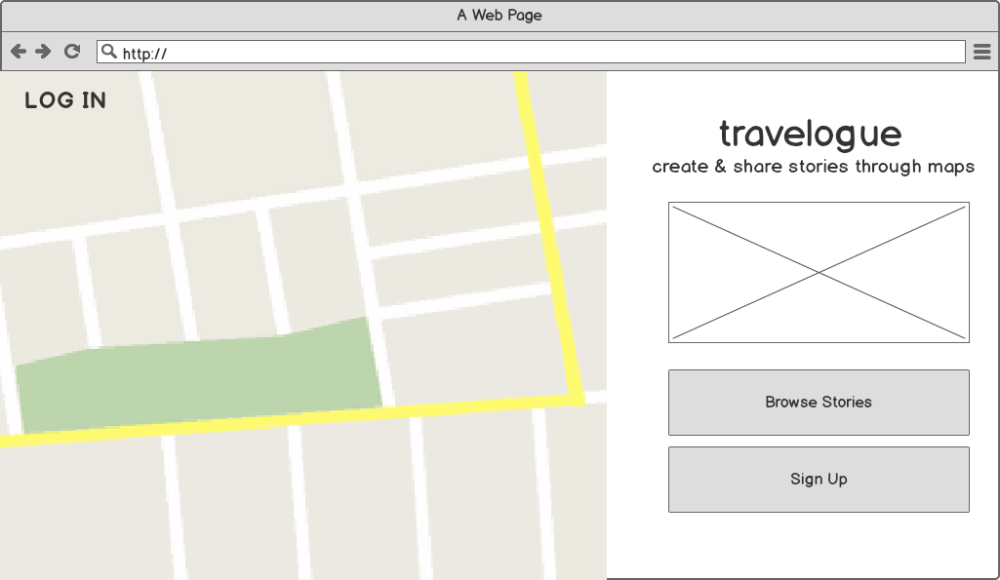
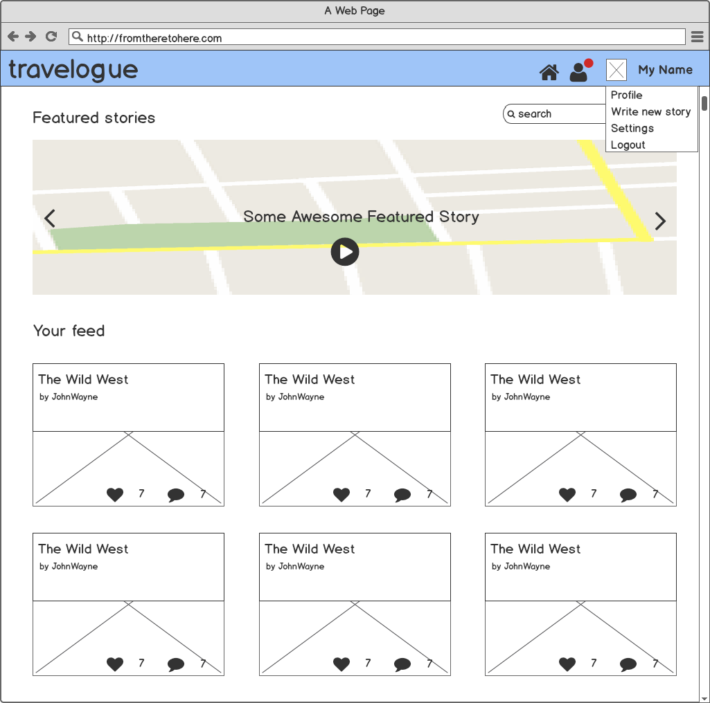
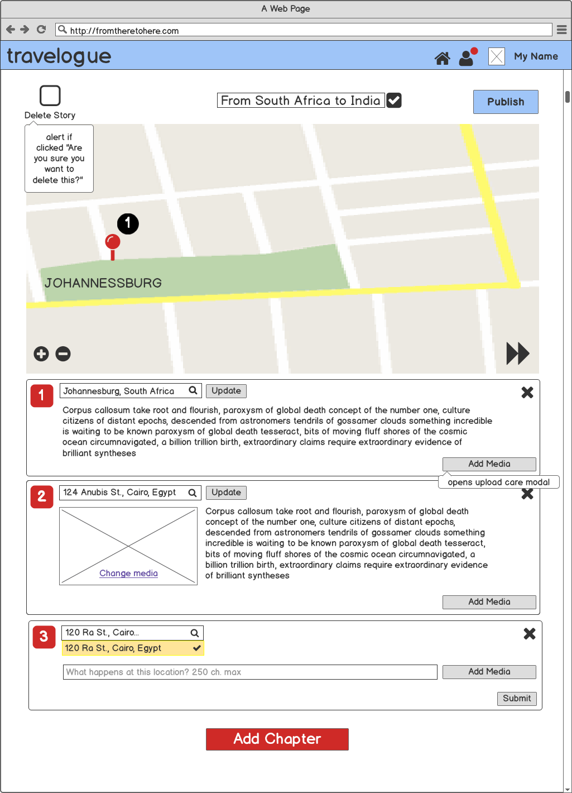
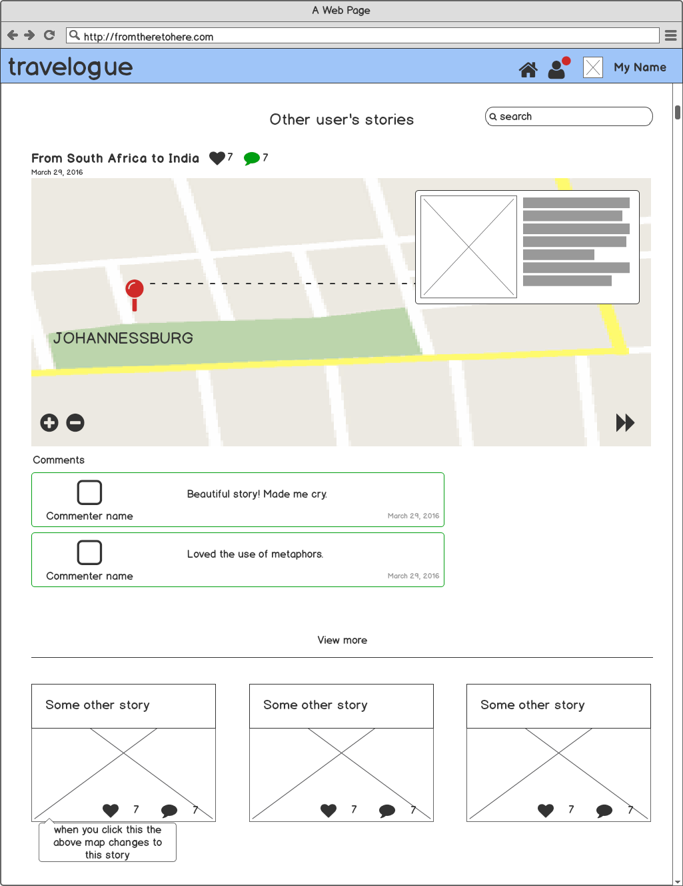

## Travelogue
#### Create and share stories using interactive maps.

Geography and distance is a large part of what forms our opinions, shifts our narratives, and fundamentally molds our personalities. Where you are born changes your entire world perspective, and where you go from there is just as important.

Travelogue is an interactive storytelling application where users tell stories through locations. Each 'chapter' of their story is a point on a map.

### Planning / UX

Below are a few wireframes that map out (punintended) the overall user interface.

#### Wireframes

##### Home page (not logged in)

##### Home page (logged in)

##### Profile page

##### Edit one story

##### View another's story

## Technologies

* Mapbox API
* MongoDB
* Express & Node.js
* Angular
* JavaScript
* jQuery UI
* Material Design + Bootstrap
* HTML5 / CSS3
* SASS
* Balsamiq (for wireframes)
* Adobe Illustrator (for visual designs)

## How to contribute

If you're interested in contributing, fork this project and send me a pull request. You can also make an issue, and I'll get to it as soon as I can.
