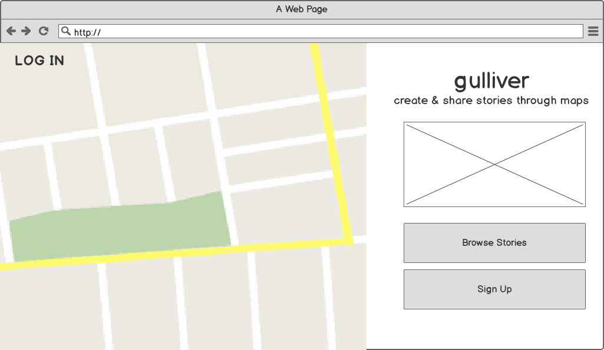
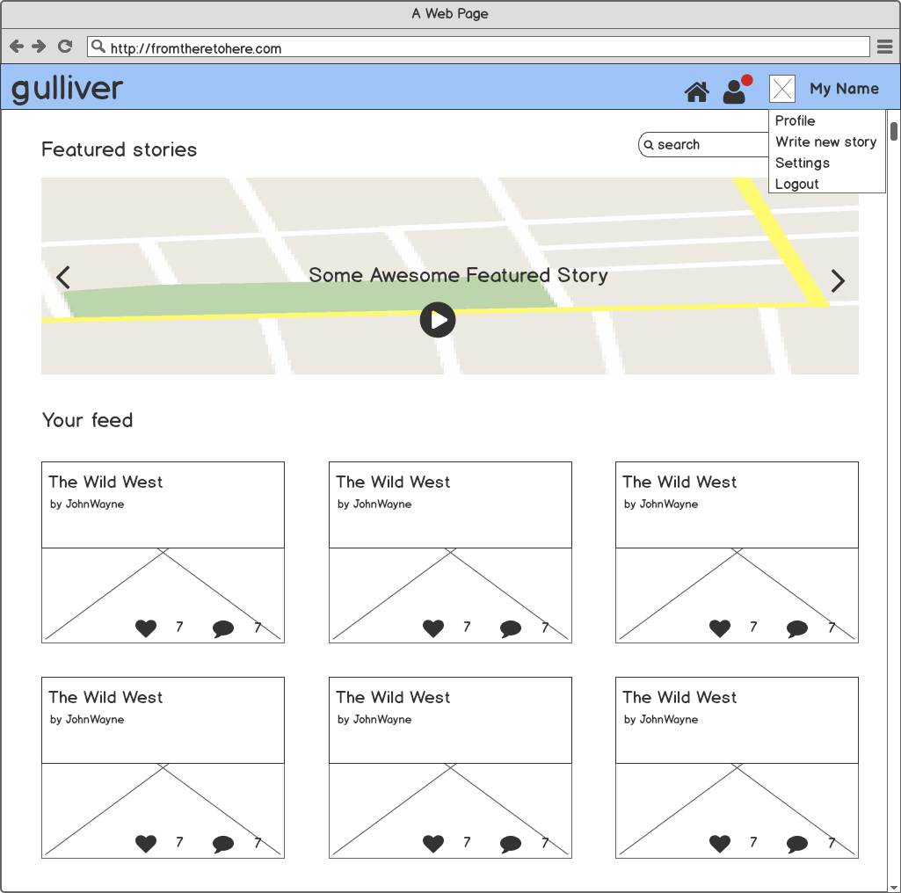
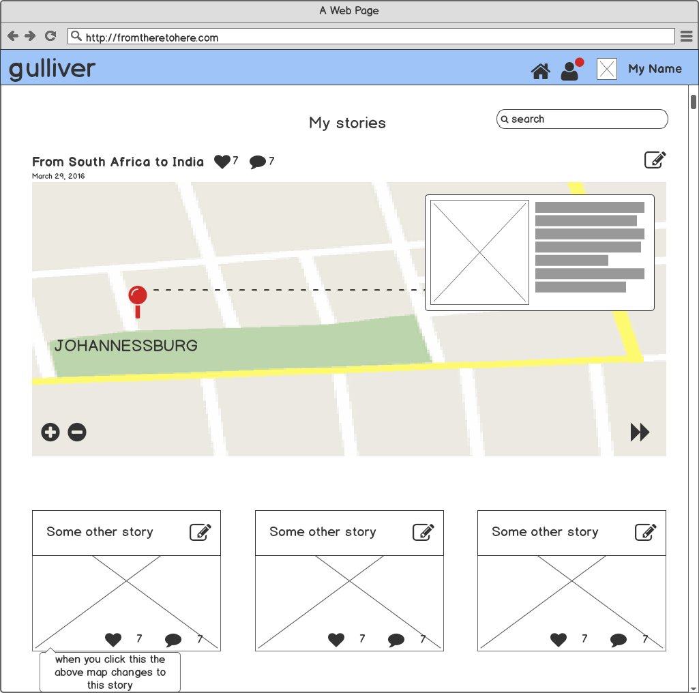
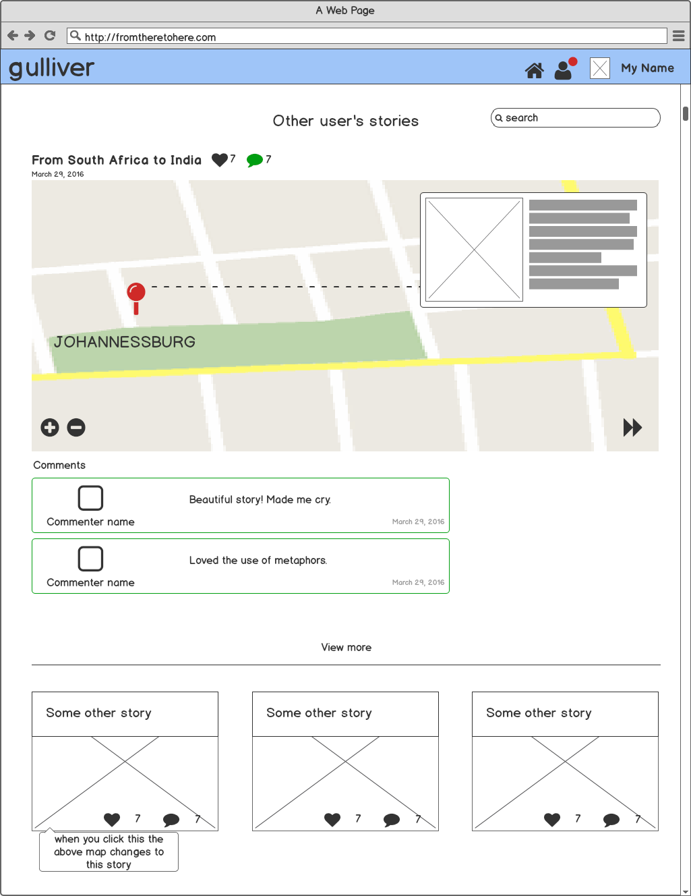

## Gulliver
#### Create and share stories using interactive maps.

Geography and distance is a large part of what forms our opinions, shifts our narratives, and fundamentally molds our personalities. Where you are born changes your entire world perspective, and where you go from there is just as important.

Gulliver is an interactive storytelling application where users can tell stories based on their locations. Each 'chapter' of their story is a pin on a map.

### Planning / UX

Below are a few wireframes that map out (pun intended) the overall user interface. Some features have not been added yet, such as the comments, likes, and addition of other media such as photos/video.

Weirdly interesting in my super-organized Trello board? [Check it out](https://trello.com/b/IuXD8UrZ/gulliver-app)

#### Wireframes

##### Landing page (not logged in)
<!--  -->

##### Discover page (logged in)
<!--  -->

##### My stories page
<!--  -->

##### Edit one story
<!--  -->

##### View another's story
<!--  -->

## Technologies

* MongoDB
* Express
* Node.js
* Angular
* [Mapbox API](https://www.mapbox.com/api-documentation/#geocoding)
* [Leaflet-Angular-Directive](http://tombatossals.github.io/angular-leaflet-directive/#!/examples/simple-map)
* [VS-Google-Autocomplete](https://github.com/vskosp/vsGoogleAutocomplete)
* JavaScript
* [Materialize CSS](http://materializecss.com)
* HTML5 / CSS3
* Balsamiq (for wireframes)

## Code

**Planning to contribute?** Here's a brief explanation of how I'm displaying my stories on a map using Angular and the Leaflet-Angular-Directive.

First, here's how you render a map to your page:

* Include this tag within your HTML.

         <leaflet lf-center="center"  width="100%" height="350px" markers="markers" icon="icon" layers="layers" defaults="defaults"></leaflet>

* The attributes `markers`, `center`, etc. refer to what's attached to your controller's `$scope`.  Here's what that looks like in your client-side controller  (i.e. `CreateStoryController.js`)

          angular.extend($scope, {
              center: {
                //where the map will be centered
                lat: 40.095,
                lng: -3.823,
                zoom: 4
              },
              markers: {
              //where you add your markers!
                {
                  lat: 40,
                  lng: -3,
                  message: "Hi, I'm a point on a map!" //the message added to each point

                }
              },
              defaults: {
                // checkout the Leaflet docs for more default settings
                scrollWheelZoom: 'center',
                markerZoomAnimation: true,
                autoPan: true,
                watch: true
              }
          });

* To render a place new points, all you have to do is push new markers into the `$scope.markers`.

*Files not shown*:
* *I've hidden my Mapbox API Key as well as my `.env` file which includes my secret token for authentication. You will need to get your own keys in order for these to work (and make sure you add it in your `.gitignore`! ).*

## Future features
###### AKA contingent on whether I have the time

* Users will be able to add photos and other media to each point.
* Users will be able to *like* and *comment* other users' stories.
* Users will be able to *follow* other users.
* Users will be able to upload a profile picture and have a short bio.

## Contributors

Special thanks to...
* [tombatossals / David Rubert](https://github.com/tombatossals) for their amazing Leaflet-Angular-Directive that allowed me to incorporate Mapbox & Leaflet into this Angular project
* [vskosp / Kostiantyn Polishchuk](https://github.com/vskosp) for their super helpful Angular Google Maps autocomplete feature
* [Vien Van](https://github.com/vienvan) for discovering the world of Angular + Leaflet/Mapbox with me
* [Ilias Tsangaris](https://github.com/iliastsangaris) for explaining promises and callback functions
* [Dani Zaghian](https://github.com/DaniZaghian) for her mentorship and convincing me to use Materialize
* [Annabelle Thaddeus](https://github.com/thaddak0) for singing Avril with me in the mornings to brighten our moods

